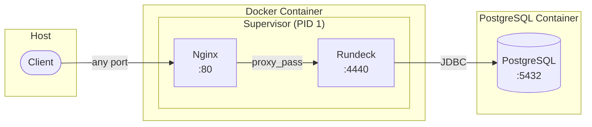

# Rundeck Docker Image

Custom Rundeck Docker image with Nginx reverse proxy and Supervisor process management.

**Author:** Sergio Rodriguez <sergio.rodriguez@cbba.cloud.org.bo>  
**GitHub:** https://github.com/Walsen  
**Blog:** https://blog.walsen.website  
**Date:** 2026-01-28

## Architecture



## Quick Start

```bash
# Start the full stack (PostgreSQL + Rundeck)
docker compose up -d

# Access Rundeck at http://localhost:8080
# Default credentials: admin / admin
```

## Custom Port Mapping

The image supports any external port. Just set `RUNDECK_GRAILS_URL` to match:

```bash
# Port 8080
docker run -p 8080:80 -e RUNDECK_GRAILS_URL=http://localhost:8080 ffactory/rundeck

# Port 80 (default)
docker run -p 80:80 -e RUNDECK_GRAILS_URL=http://localhost ffactory/rundeck

# Any custom port
docker run -p 9000:80 -e RUNDECK_GRAILS_URL=http://localhost:9000 ffactory/rundeck
```

## Configuration

### Build Arguments

| Argument | Default | Description |
|----------|---------|-------------|
| `RUNDECK_VERSION` | `5.15.0` | Rundeck version to use |

### Environment Variables

| Variable | Default | Description |
|----------|---------|-------------|
| `RUNDECK_GRAILS_URL` | `http://localhost:8080` | External URL (must match your port mapping) |
| `RUNDECK_DATABASE_URL` | - | PostgreSQL JDBC URL |
| `RUNDECK_DATABASE_USERNAME` | - | Database username |
| `RUNDECK_DATABASE_PASSWORD` | - | Database password |

### Mounted Volumes

| Path | Description |
|------|-------------|
| `./config/realm.properties` | User authentication config |
| `./config/rundeck-site.conf` | Nginx site configuration |

## Files

| File | Description |
|------|-------------|
| `Dockerfile` | Container build definition |
| `docker-compose.yml` | Full stack orchestration |
| `supervisord.conf` | Process manager configuration |
| `start-services.sh` | Container entrypoint (configures nginx dynamically) |
| `config/nginx.conf` | Main Nginx configuration |
| `config/rundeck-site.conf` | Nginx reverse proxy config |
| `config/realm.properties` | Rundeck user/role definitions |
| `.github/workflows/build.yml` | CI/CD pipeline |

## GitHub Actions

The workflow:
- **Feature branches / PRs:** Build and test only
- **Merge to main:** Build, test, and push to `ffactory/rundeck` on Docker Hub
- **Weekly schedule:** Check for new Rundeck releases
- **Manual trigger:** Build specific version

Tags pushed: `<version>` and `latest`

## License

See [LICENSE](LICENSE) file.
