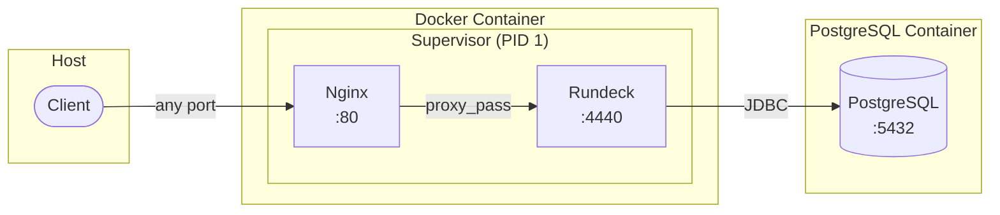

# Rundeck Docker Image

[](https://github.com/Walsen/rundeck-image/actions/workflows/build.yml)
[](https://hub.docker.com/r/ffactory/rundeck)
[](https://hub.docker.com/r/ffactory/rundeck)

Custom Rundeck Docker image with Nginx reverse proxy and Supervisor process management.

**Author:** Sergio Rodriguez <sergio.rodriguez@cbba.cloud.org.bo>  
**GitHub:** https://github.com/Walsen  
**Blog:** https://blog.walsen.website  
**Date:** 2026-01-31

## Architecture


```mermaid
flowchart LR
    subgraph Host
        Client([Client])
    end

    subgraph Docker["Docker Container"]
        subgraph Supervisor["Supervisor (PID 1)"]
            Nginx["Nginx\n:80"]
            Rundeck["Rundeck\n:4440"]
        end
    end

    subgraph Database["PostgreSQL Container"]
        Postgres[(PostgreSQL\n:5432)]
    end

    Client -->|"any port"| Nginx
    Nginx -->|"proxy_pass"| Rundeck
    Rundeck -->|"JDBC"| Postgres
```

## Features

- **Nginx Reverse Proxy**: Flexible port mapping with automatic configuration
- **Supervisor Process Management**: Reliable multi-process container
- **PostgreSQL Support**: Production-ready database backend
- **Pre-installed Plugins**:
  - [rundeck-node-to-node](https://github.com/Walsen/rundeck-node-to-node): Node-to-node file copy plugin (automatically updated to latest version)

## Quick Start

```bash
# Start the full stack (PostgreSQL + Rundeck)
docker compose up -d

# Access Rundeck at http://localhost:8080
# Default credentials: admin / admin
```

## Docker Compose Example

```yaml
services:
  postgres:
    image: postgres:15
    environment:
      POSTGRES_DB: rundeck
      POSTGRES_USER: rundeck
      POSTGRES_PASSWORD: rundeck123
    volumes:
      - postgres_data:/var/lib/postgresql/data
    healthcheck:
      test: ["CMD-SHELL", "pg_isready -U rundeck"]
      interval: 10s
      timeout: 5s
      retries: 5

  rundeck:
    image: ffactory/rundeck:latest
    ports:
      - "8080:80"
    environment:
      RUNDECK_GRAILS_URL: http://localhost:8080
      RUNDECK_DATABASE_DRIVER: org.postgresql.Driver
      RUNDECK_DATABASE_USERNAME: rundeck
      RUNDECK_DATABASE_PASSWORD: rundeck123
      RUNDECK_DATABASE_URL: jdbc:postgresql://postgres:5432/rundeck
    volumes:
      - rundeck_data:/home/rundeck/server/data
      - rundeck_logs:/home/rundeck/var/logs
    depends_on:
      postgres:
        condition: service_healthy

volumes:
  postgres_data:
  rundeck_data:
  rundeck_logs:
```

## Custom Port Mapping

The image supports any external port. Just set `RUNDECK_GRAILS_URL` to match:

```bash
# Port 8080
docker run -p 8080:80 -e RUNDECK_GRAILS_URL=http://localhost:8080 ffactory/rundeck

# Port 80 (default)
docker run -p 80:80 -e RUNDECK_GRAILS_URL=http://localhost ffactory/rundeck

# Any custom port
docker run -p 9000:80 -e RUNDECK_GRAILS_URL=http://localhost:9000 ffactory/rundeck
```

## Configuration

### Build Arguments

| Argument | Default | Description |
|----------|---------|-------------|
| `RUNDECK_VERSION` | `5.18.0` | Rundeck version to use |

### Environment Variables

| Variable | Default | Description |
|----------|---------|-------------|
| `RUNDECK_GRAILS_URL` | `http://localhost:8080` | External URL (must match your port mapping) |
| `RUNDECK_DATABASE_URL` | - | PostgreSQL JDBC URL |
| `RUNDECK_DATABASE_USERNAME` | - | Database username |
| `RUNDECK_DATABASE_PASSWORD` | - | Database password |

### Mounted Volumes

| Path | Description |
|------|-------------|
| `./config/realm.properties` | User authentication config |
| `./config/rundeck-site.conf` | Nginx site configuration |

## Files

| File | Description |
|------|-------------|
| `Dockerfile` | Container build definition |
| `docker-compose.yml` | Full stack orchestration |
| `supervisord.conf` | Process manager configuration |
| `start-services.sh` | Container entrypoint (configures nginx dynamically) |
| `config/nginx.conf` | Main Nginx configuration |
| `config/rundeck-site.conf` | Nginx reverse proxy config |
| `config/realm.properties` | Rundeck user/role definitions |
| `.github/workflows/build.yml` | CI/CD pipeline |

## GitHub Actions

The workflow:
- **Feature branches / PRs:** Build and test only
- **Merge to main:** Build, test, and push to `ffactory/rundeck` on Docker Hub
- **Weekly schedule:** Check for new Rundeck releases
- **Manual trigger:** Build specific version

Tags pushed: `<version>` and `latest`

## License

See [LICENSE](LICENSE) file.
